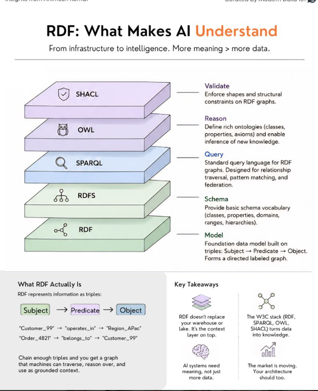

# Ontology GraphRAG Benchmarks

**Biomedical Knowledge Graph with Real Neptune vs Neo4j Benchmarks**

A production-grade biomedical knowledge graph demonstrating the W3C semantic web stack, GraphRAG architectures, HNSW vector indexing, and multi-agent clinical risk assessment. Includes real benchmarks against live AWS Neptune and Neo4j Aura infrastructure.

---

## W3C Semantic Web Stack

The foundation of this project is the W3C RDF stack -- a layered architecture that turns raw data into machine-understandable knowledge:

```
+--------------+
|    SHACL     |  Validate -- enforce shapes and structural constraints
+--------------+
|    OWL       |  Reason -- define ontologies, enable inference of new knowledge
+--------------+
|   SPARQL     |  Query -- traversal, pattern matching, federation
+--------------+
|    RDFS      |  Schema -- classes, properties, domains, ranges, hierarchies
+--------------+
|    RDF       |  Model -- Subject -> Predicate -> Object triples
+--------------+
```

RDF represents information as triples: `Subject -> Predicate -> Object`. Chain enough triples and you get a directed labeled graph that machines can traverse, reason over, and use as grounded context for AI.

> RDF doesn't replace your warehouse or lake. It's the context layer on top. The W3C stack turns data into knowledge.



---

## Architecture Comparison: Neptune vs Neo4j

This project benchmarks **three GraphRAG architectures** for combining vector similarity search with graph traversal:

### Architecture 1: Neo4j Aura (Unified)
```
+------------------------------+
|        Neo4j Aura            |
|  +--------+  +------------+ |
|  |  HNSW  |  |   Cypher   | |
|  | Vector |--|   Graph    | |
|  | Index  |  | Traversal  | |
|  +--------+  +------------+ |
|     ONE query, ZERO friction |
+------------------------------+
```
- Native HNSW vector index + Cypher graph traversal in a **single query**
- `CALL db.index.vector.queryNodes()` then `MATCH (drug)-[:TREATS]->(disease)`
- Zero serialization overhead between vector and graph layers

### Architecture 2: Neptune Analytics (Unified)
```
+------------------------------+
|    Neptune Analytics         |
|  +--------+  +------------+ |
|  | Native |  | openCypher | |
|  | Vector |--|   Graph    | |
|  | Search |  | Traversal  | |
|  +--------+  +------------+ |
|     ONE query, ZERO friction |
+------------------------------+
```
- Native vector search via `neptune.algo.vectors.topKByEmbedding()` + openCypher
- Vector embeddings stored as node properties via `neptune.algo.vectors.upsert()`
- Same-query unified architecture -- no external vector DB needed

### Architecture 3: Neptune DB + OpenSearch (Two-Layer)
```
+--------------+    serialize    +--------------+
|  OpenSearch   |----- IDs ----->|  Neptune DB   |
|  (kNN HNSW)  |    (friction)   |  (Gremlin)   |
|              |                 |              |
| Vector Search|                 |Graph Traversal|
+--------------+                 +--------------+
     Step 1            Step 2          Step 3
```
- Step 1: OpenSearch kNN returns candidate drug IDs
- Step 2: Serialize IDs for cross-service transfer (friction)
- Step 3: Neptune DB Gremlin traverses graph for those candidates
- Two network hops, two query languages, serialization overhead

---

## Real Benchmark Results

Every number below is a **real measurement** against live infrastructure. No simulations, no math models.

| Architecture | Mean Latency | Min | Max | Friction |
|---|---|---|---|---|
| **Neptune Analytics** (unified) | **34.8 ms** | 32.6 ms | 37.1 ms | 0 ms |
| **Neptune DB + OpenSearch** (two-layer) | **69.1 ms** | 32.3 ms | 180.5 ms | ~0.04 ms |
| **Neo4j Aura** (unified) | **208.1 ms** | 175.1 ms | 261.2 ms | 0 ms |

### Per-Query Breakdown

| Query | Neo4j Aura | Neptune Analytics | Neptune DB + OpenSearch |
|---|---|---|---|
| PD-1 inhibitor (Immuno) | 249.6 ms | 34.4 ms | 180.5 ms |
| HER2 antibody (HER2) | 175.1 ms | 37.1 ms | 39.2 ms |
| Kinase inhibitor (TKI) | 175.2 ms | 32.6 ms | 32.3 ms |
| GLP-1 peptide (GLP1) | 179.3 ms | 37.0 ms | 56.9 ms |
| Amyloid-beta Ab (Amyloid) | 261.2 ms | 33.0 ms | 36.5 ms |

### Key Findings

1. **Neptune Analytics is ~6x faster than Neo4j Aura** -- same-region AWS infrastructure vs cross-region Aura cloud
2. **Unified architectures eliminate friction** -- both Neo4j and Neptune Analytics execute vector search + graph traversal in a single query
3. **Two-layer overhead is real** -- Neptune DB + OpenSearch has high variance (32-180ms) from cold starts and cross-service network hops
4. **Neo4j's latency is geographic, not architectural** -- the ~175ms baseline is dominated by network round-trip to Aura cloud, not query execution

### Benchmark Configuration
- Vector dimensions: 384
- Top-K: 5
- Iterations per query: 10
- Dataset: 10 drugs, 7 diseases, 14 TREATS relationships
- Neo4j: Aura cloud instance
- Neptune Analytics: us-west-2
- Neptune DB: us-west-2
- OpenSearch: us-west-2 (HNSW kNN engine)

---

## HNSW Tuning and Sparse Matrix Analysis

The project includes a dedicated HNSW parameter tuning demo against live Neo4j, testing three configurations:

| Config | M (connectivity) | efConstruction | efRuntime | Use Case |
|---|---|---|---|---|
| Fast/Low Memory | 4 | 32 | 32 | Prototyping, small datasets |
| Balanced | 16 | 100 | 100 | Production default |
| Max Recall | 48 | 256 | 256 | Clinical-grade accuracy |

The sparse matrix analysis shows how graph adjacency + vector similarity combine into a unified structure, demonstrating why native vector support (Neo4j HNSW or Neptune Analytics) eliminates the need for a separate vector database.

---

## Project Structure

```
.
|-- README.md
|-- Graph/
|   |-- Graph.png                         # W3C RDF Stack diagram
|   |-- Knowledge_Graph_POC_BioMedical.pptx
|
|-- ontology/
|   |-- biomedical_ontology.ttl           # OWL ontology (19 classes, 17 object props, 22 datatype props)
|   |-- biomedical_ontology.dot           # GraphViz DOT format
|   |-- biomedical_ontology_diagram.html  # Interactive ontology viewer
|
|-- data/sample/
|   |-- drugs.csv                         # 10 drugs with mechanisms, types, approval status
|   |-- diseases.csv                      # 10 diseases with ICD-10 codes, categories
|   |-- clinical_trials.csv              # 10 clinical trials (phases, enrollment, NCT IDs)
|   |-- genes.csv                         # 10 genes with symbols, chromosomes
|   |-- proteins.csv                      # 10 proteins with UniProt IDs, cellular locations
|   |-- biomarkers.csv                    # 10 biomarkers
|   |-- researchers.csv                   # 10 researchers with h-index, publications
|   |-- research_papers.csv              # Research papers
|   |-- institutions.csv                  # Research institutions
|   |-- adverse_events.csv               # Adverse event reports
|   |-- relationships/                    # 12 relationship CSVs (TREATS, TARGETS, etc.)
|
|-- validation/
|   |-- shacl_shapes.ttl                  # SHACL constraint shapes for all entity types
|
|-- queries/
|   |-- sparql_queries.sparql             # 29 SPARQL query examples
|
|-- scripts/
|   |-- csv_to_rdf.py                     # CSV -> RDF Turtle conversion
|   |-- csv_to_neo4j.py                   # CSV -> Neo4j Cypher import
|
|-- main.py                               # W3C demo: load ontology, SHACL validation, SPARQL queries
|-- real_neptune_vs_neo4j_benchmark.py    # Real 3-architecture benchmark
|-- hnsw_sparse_matrix_demo.py            # HNSW tuning + sparse matrix analysis on Neo4j
|-- graphrag_benchmark.py                 # GraphRAG benchmark suite (scale models)
|-- strands_production_grade.py           # AWS Strands multi-agent clinical risk assessment
|
|-- neptune_graph_full.html               # Interactive viz: Drug -> Disease graph
|-- neptune_graph_coindication.html       # Interactive viz: Co-indication network
|-- neptune_graph_mechanisms.html         # Interactive viz: Mechanism clusters
|-- neptune_vector_search_graph.html      # Interactive viz: Vector search + graph
|-- neptune_graph_visualization.ipynb     # Jupyter notebook with graph-notebook magic commands
|
|-- real_benchmark_comparison.json        # Raw benchmark results (all 3 architectures)
|-- .env.example                          # Environment variable template
|-- .gitignore
```

---

## Ontology Model

The biomedical ontology defines 19 classes across the pharmaceutical domain:

```
Drug --treats--> Disease
  |                 |
  |--targets--> Protein <--encodedBy-- Gene
  |                                      |
  |--investigatedIn--> ClinicalTrial     |--associatedWith--> Disease
  |                        |
  |--hasAdverseEvent--> AdverseEvent

Researcher --conducts--> ClinicalTrial
    |
    |--authorOf--> ResearchPaper
    |--affiliatedWith--> Institution

Biomarker --predictsResponseTo--> Drug
```

### SHACL Validation Rules
- Drug IDs match pattern `D###`, approval status in {Approved, Experimental, Withdrawn}
- Disease IDs match `DIS###`, categories in {Oncology, Metabolic, Neurology, Cardiovascular, Infectious}
- Clinical trial NCT IDs match `NCT########`, phases 1-4, enrollment > 0
- Gene symbols are uppercase alphanumeric, proteins have valid UniProt IDs
- Cross-entity rules: Phase 3 trials must have enrollment >= 100, immune checkpoint drugs must be classified as Immunotherapy

---

## Multi-Agent Clinical Risk Assessment

The AWS Strands agent framework implements 5 specialized agents that compute 7-factor risk scores:

| Agent | Role |
|---|---|
| **PharmacologyAgent** | Drug mechanism analysis, efficacy scoring |
| **ClinicalSafetyAgent** | Adverse event assessment, safety profiling |
| **GeneticsAgent** | Genomic marker analysis, mutation impact |
| **DrugInteractionAgent** | Multi-drug interaction checking |
| **PatientProfileAgent** | Patient-specific risk factor integration |

Risk score factors: drug efficacy, adverse event severity, genetic compatibility, drug interactions, trial evidence strength, biomarker predictiveness, patient comorbidities.

---

## Quick Start

### W3C Semantic Stack Demo
```bash
pip install rdflib pyshacl
python main.py
```

### Neo4j + HNSW Tuning
```bash
pip install neo4j numpy
# Set NEO4J_URI, NEO4J_USER, NEO4J_PASS in .env
python hnsw_sparse_matrix_demo.py
```

### Real Neptune vs Neo4j Benchmark
```bash
pip install neo4j numpy boto3 gremlinpython opensearch-py requests-aws4auth
# Requires: Neptune Analytics graph, Neptune DB cluster, OpenSearch domain
python real_neptune_vs_neo4j_benchmark.py
```

### Graph Visualization
Open the interactive HTML files directly in a browser:
- `neptune_graph_full.html`
- `neptune_graph_coindication.html`
- `neptune_graph_mechanisms.html`
- `neptune_vector_search_graph.html`

---

## Interactive Graph Visualizations

Four interactive HTML visualizations are included (open in any browser):

| File | Description |
|---|---|
| `neptune_graph_full.html` | Full Drug -> Disease graph with mechanism coloring |
| `neptune_graph_coindication.html` | Drug-Drug co-indication network (shared disease targets) |
| `neptune_graph_mechanisms.html` | Drugs clustered by mechanism of action |
| `neptune_vector_search_graph.html` | Neptune Analytics vector search results overlaid on graph |

All graphs feature drag-and-drop nodes, zoom, hover tooltips with properties, and physics-based layouts.

---

## Technologies

| Layer | Technology |
|---|---|
| Ontology | RDF, RDFS, OWL (Turtle format) |
| Validation | SHACL (W3C Shapes Constraint Language) |
| Query | SPARQL 1.1, Cypher, openCypher, Gremlin |
| Graph DB | Neo4j Aura, AWS Neptune DB, Neptune Analytics |
| Vector Search | Neo4j HNSW, Neptune native vectors, OpenSearch kNN |
| Agents | AWS Strands Agent Framework |
| LLM | AWS Bedrock |
| Visualization | PyVis, graph-notebook, Jupyter |

---

## License

This project is for educational and research purposes.
